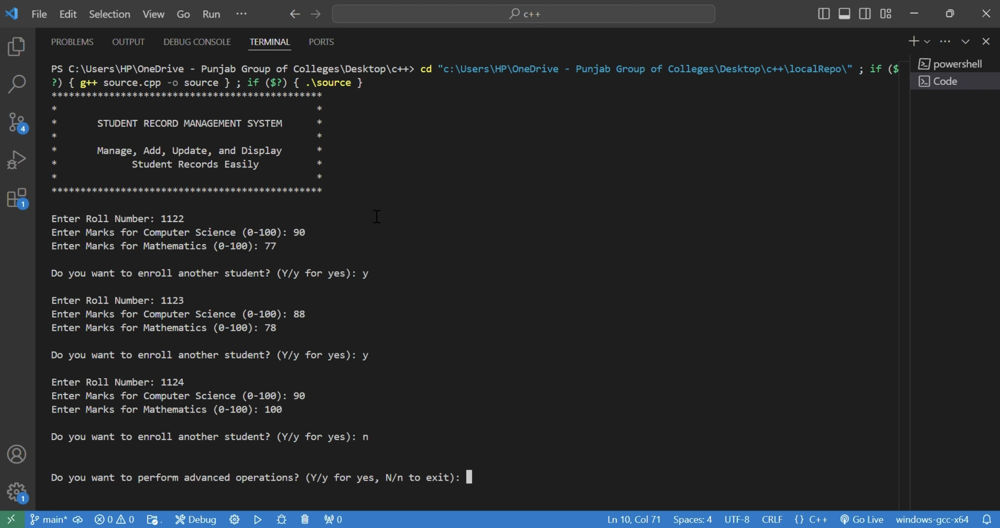

# Student-Record-Management-System

Take a look at my **console-based Student Record Management System**, developed in C++! 📚 This project allows users to easily manage and manipulate student records including roll numbers, marks, percentages, and grades.



## Table of Contents
- [Introduction](#introduction)
- [Project Overview](#project-overview)
- [Features](#features)
- [Installation](#installation)
- [Live Preview](#live-preview)
- [Usage Instructions](#usage-instructions)
- [File Structure](#file-structure)
- [Technologies Used](#technologies-used)
- [Code Explanation](#code-explanation)
- [Future Improvements](#future-improvements)
- [Conclusion](#conclusion)

## Introduction
The **Student Record Management System** is a console-based application built using C++. It enables users to create, modify, and manage student records for up to 5 students. The program calculates percentages and assigns grades based on the marks entered for Computer Science and Mathematics.

## Project Overview
This project is ideal for small-scale academic use, where users need to track a limited number of students' information. It stores details such as roll numbers, marks in Computer Science and Mathematics, percentages, and grades.

## Features
- **Add Student Records**: Add records for up to 5 students.
- **Update Records**: Modify student details, including marks for individual subjects or the entire class.
- **Sort Records**: Sort records based on percentages, helping identify top-performing students.
- **Delete Records**: Remove student data from the system.
- **Display Records**: View the list of student records with grades and percentages.
- **Advanced Operations**: Update roll numbers, subject marks (individual or entire class), and perform sorting or deletion tasks.

## Installation
To run the Student Record Management System, follow these steps:

1. **Download the Source Code**: Clone or download the repository.
2. **Compile the Code**:
   - Open your terminal/command prompt and navigate to the folder containing the `Source.cpp` file.
   - Compile the C++ code using the following command:
     ```bash
     g++ -o Student-Record-Management-System Source.cpp
     ```
3. **Run the Program**:
   ```bash
   ./Student-Record-Management-System
   ```

## Live Preview

Get a glimpse of how the program works with the following screen recording:

[`Screen Recording`](screenRecording.MP4)

> **Note:** The quality of these screen recordings has been reduced to comply with GitHub's 25MB file size limit.

## Usage Instructions
1. **Start the Program**: Upon launching, you can enter student roll numbers and marks for both Computer Science and Mathematics. The system calculates the percentage and assigns a grade.
2. **Add a Record**: Enter the student roll number and their marks for CS and Math. The percentage and grade will be calculated automatically.
3. **Advanced Operations**: Perform tasks like updating records, sorting students by percentage, or deleting records.
4. **Display Records**: View the full list of students' information, including calculated percentages and grades.

### Grading System:
- A: 91% - 100%
- B: 75% - 90%
- C: 60% - 74%
- D: 50% - 59%
- F: Below 50%

## File Structure
- **Source.cpp**: Contains the complete source code for the Student Record Management System.

## Technologies Used
- **Languages**: C++
- **Compilers**: Dev-C++, Visual Studio Code, or any C++ compiler of your choice.

## Code Explanation
- **Data Management**: The program uses arrays to store roll numbers, marks, percentages, and grades.
- **Percentage Calculation**: The percentage is calculated by averaging marks from Computer Science and Mathematics.
- **Grade Assignment**: Based on the percentage, a grade is assigned to each student.
- **Advanced Features**: The code includes features for updating records, sorting by percentage, and deleting student entries.

## Future Improvements
- **Increase Capacity**: Allow more than 5 students.
- **File Persistence**: Implement file handling to save and load student records for future use.
- **User Interface**: Add a graphical user interface (GUI) for better usability.
- **Search Feature**: Include a feature to search for students by roll number or name.

## Conclusion
This project provides a simple yet effective way to manage student data using basic console operations in C++. Future enhancements could expand its capability and usability for broader applications.

Enjoy using this system to manage student records efficiently! 😊
